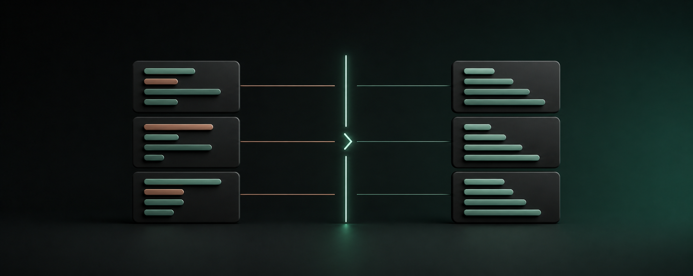

# toml-tidy



[](https://github.com/AndrewDongminYoo/toml-tidy/actions/workflows/ci.yml)
[](https://pypi.org/project/toml-tidy/)
[](https://pypi.org/project/toml-tidy/)
[](LICENSE)
[](#pre-commit)
[](#trunk)

Sort TOML keys while preserving table hierarchy and source formatting where `tomlkit` supports it.

## Install

Install from [PyPI](https://pypi.org/project/toml-tidy/):

```bash
pip install toml-tidy
```

Or as a standalone tool with `uv`:

```bash
uv tool install toml-tidy
```

Or run it once without installing:

```bash
uvx toml-tidy pyproject.toml
```

For development from a local checkout, use `uv tool install .`.

## Usage

```bash
toml-tidy pyproject.toml
toml-tidy pyproject.toml --check
toml-tidy pyproject.toml --in-place --order natural
toml-tidy config/*.toml --in-place --scope tables
```

The command accepts one or more file paths and processes each one, so it works directly as a pre-commit or trunk formatter target.

Without `--in-place`, sorted TOML is written to standard output; this mode takes exactly one path so separate documents never get concatenated.

`--check` writes nothing and exits with status `1` when any file requires sorting.

`--in-place` rewrites each file only when sorting changes it.

With multiple paths the worst exit code wins: `2` for any error, else `1` for any check difference, else `0`; an error in one file does not stop the remaining files.

`--scope` limits what gets sorted: `all` (default) sorts everything, `tables` sorts only sibling table declarations, and `keys` sorts only direct key-value entries.

`--blank-lines` additionally normalizes blank lines to exactly one before every table header and none anywhere else; `--no-blank-lines` (the default) leaves every blank line where it was.

## Configuration

Defaults can be set in the nearest `pyproject.toml` found walking up from each target file, under `[tool.toml-tidy]`.
CLI flags always override the configuration.

```toml
[tool.toml-tidy]
order = "natural"   # or "alpha"
scope = "all"       # "tables" | "keys"
first = ["project", "build-system"]
blank-lines = false # true normalizes blank lines
```

`first` pins top-level entries by name, in the listed order, ahead of their sorted siblings; it never applies inside nested tables, and it has no CLI flag.

Unknown keys in `[tool.toml-tidy]` are rejected so configuration typos cannot silently fall back to defaults.

## pre-commit

```yaml
repos:
  - repo: https://github.com/AndrewDongminYoo/toml-tidy
    rev: v0.4.1 # pin the latest release; the hook ships from v0.2.0 onward
    hooks:
      - id: toml-tidy
```

The hook runs `toml-tidy --in-place`, and `args` are appended to it, so flags are set per repository without losing in-place rewriting:

```yaml
hooks:
  - id: toml-tidy
    args: [--blank-lines, --order, alpha]
    exclude: ^uv\.lock$ # lockfiles are TOML too
```

## Trunk

`toml-tidy` is available as an opt-in formatter through [Trunk](https://trunk.io/).

See the [official Trunk plugin definition](https://github.com/trunk-io/plugins/tree/main/linters/toml-tidy) for setup and runtime requirements.

## Ordering

`natural` is the default and compares digit runs numerically, so `item2` precedes `item10`.

`alpha` uses case-insensitive lexical order.

Both modes compare TOML's parsed logical key, not source quoting.

Dotted keys such as `b.a = 2` sort with their sibling direct keys by their parsed dotted path, segment by segment, so `a` precedes `b.a`, which precedes `b.z`.

For example, `[plugins.omo]` precedes `[plugins."omo-kit"]`, while the quoted spelling remains unchanged in output.

## Preservation

Direct keys and sibling explicit table declarations are sorted recursively within their parent table.

Array-of-tables declarations such as `[[items]]` sort by name among their sibling tables, while the element order inside each array of tables remains unchanged.

Parent-child hierarchy remains unchanged.

Standalone comments move with the following key or table declaration.

Whitespace between entries remains after the preceding entry, and trailing whitespace remains at its table boundary, unless `--blank-lines` is enabled.

Inline comments and key quoting remain attached to their parsed `tomlkit` items.

Every non-empty single-line array uses one space after `[` and before `]`.
Empty and multi-line arrays keep their source layout.

Keys inside inline tables are not reordered.

## Blank lines

`--blank-lines` (config: `blank-lines = true`) is off by default and runs after sorting.
It rewrites blank lines only, never comments or values:

- Exactly one blank line precedes every table and array-of-tables header, above the comment run attached to that header rather than between the comment and the header.
- No blank lines remain between key-value entries, inside a comment run, or at the end of the file.
- The document's first rendered line never gains a blank line above it.
- Blank lines inside multi-line string values belong to the value, not to the layout, and are untouched.

Given this input:

```toml
a = 1

b = 2
[x]
p = 1


[y]
q = 1
```

`toml-tidy --blank-lines` produces:

```toml
a = 1
b = 2

[x]
p = 1

[y]
q = 1
```

The result is stable, so `--check` reports a file once and reports it clean after `--in-place` fixes it.

## Development

Run the same quality gates enforced by CI before committing:

```bash
uv run pytest
uv run ruff check src tests
uv run ruff format --check src tests
uv run basedpyright
```

CI runs the test suite on every supported Python version and against the lower and upper tested `tomlkit` patch releases because the sorter intentionally isolates a dependency on `tomlkit`'s private container representation.

## Releasing

A release is prepared on a `release/vX.Y.Z` branch: bump `project.version`, run `uv lock`, date the CHANGELOG section and add its compare link, and update the pre-commit `rev` above.

**Merge that pull request first, then tag the merge commit and push the tag.** Pushing the tag runs the tests, publishes to PyPI, and creates the GitHub Release from the tagged CHANGELOG section. A tag on any commit `main` has never pointed at is refused before anything is published — tagging a branch tip puts the artifact on PyPI before that branch's own review has landed on it, and the commit that was merged does not carry what the review added.
